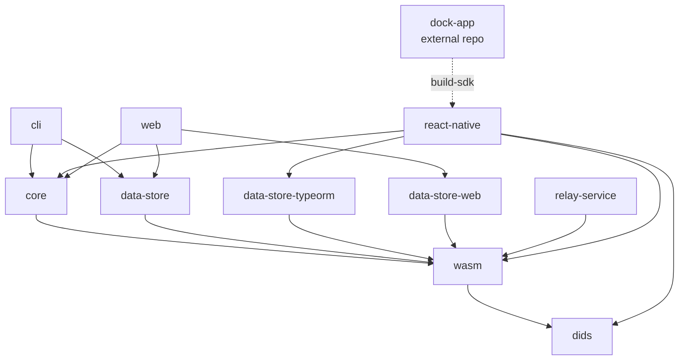

# Project Overview

`wallet-sdk` (`@docknetwork/wallet-sdk`) is Truvera's identity wallet SDK — a library (not a
deployed service) that lets a host app receive, store, and manage verifiable credentials. It is
an npm-workspaces monorepo (`packages/*`) versioned with Lerna, built on TypeScript/JavaScript
with Babel and Rollup, tested with Jest and Playwright. Each `packages/*` workspace publishes
independently to npm as its own `@docknetwork/wallet-sdk-*` package; there is no single bundled
artifact. See the [README](README.md) for the supported platforms and a usage example.

## Repository Structure

- `packages/` — the publishable workspaces; see the **Packages** table below.
- `examples/` — standalone example apps (React Native, web, Node, Angular, Flutter, Swift, a
  WebView server) that consume the published packages. Not npm workspaces of the root.
- `integration-tests/` — cross-package Jest suites run against real/staging services
  (`jest.config.e2e.js`).
- `docs/` — hand-written guides (getting started, cloud wallet, delegation, biometric plugin,
  ecosystem tools) plus a generated `docs/api/` reference.
- `scripts/` — repo-level build/test helpers (`build.sh`, `test-ci.sh`, `fix-deps.sh`,
  `fix-build-imports.js`).
- `.github/workflows/` — CI: lint/unit test, integration tests, per-example CI, npm publish, npm
  audit, docs deploy.

## Packages

| Name | Purpose |
|---|---|
| `packages/core` | Wallet orchestration — wallet lifecycle, credential/DID/message providers, verification controller. |
| `packages/wasm` | Crypto and blockchain integration layer (Cheqd, credential-sdk, OID4VCI, SD-JWT, delegation engine). Everything else in `packages/` sits on top of it. |
| `packages/data-store` | Storage interface/types and a reference `DataStore` implementation. |
| `packages/data-store-typeorm` | TypeORM-backed persistent storage backend (used by `react-native`, `cli`). |
| `packages/data-store-web` | Browser storage backend (used by `web`). |
| `packages/dids` | `did:key` resolution helpers. |
| `packages/react-native` | React Native bindings — bundles the SDK into a WebView-hosted JS bundle. Consumed externally by `dock-app` (see Architecture Notes). |
| `packages/web` | Browser UMD/ESM bundle of the SDK for non-React-Native web wallets. |
| `packages/cli` | Node CLI for exercising the SDK (BBS/revocation flows) via `ts-node`. |
| `packages/relay-service` | DIDComm relay client used for message-based credential exchange. |
| `packages/wallet-edv-storage` | Encrypted Data Vault storage adapter. Has no real tests — see Testing Strategy. |
| `packages/request-logger` | Small HTTP request-logging utility. |

`packages/scripts` and `packages/transactions` contain no `package.json` (only stray
`node_modules`) — they are not active workspaces; TODO confirm with maintainers whether they
should be removed.

Package purposes above are current as of this writing — read each package's own `package.json`
for its exact dependencies and scripts rather than assuming this table stays in sync.

## Build & Development Commands

```bash
# Install (patches deps and builds via postinstall — see scripts/fix-deps.sh)
npm install
```

```bash
# Build all publishable packages, in dependency order (see scripts/build.sh)
npm run build

# Unit tests (root Jest run across all packages/**/*.test.{js,ts}, with coverage in CI)
npm test
npm run test:ci

# Integration tests (jest.config.e2e.js, against real/staging services — needs API keys)
npm run test:integration

# Lint / format
npm run lint
npm run lint:fix
npm run format
```

```bash
# Package-scoped work, e.g.:
npm run build -w @docknetwork/wallet-sdk-core
npm test -w @docknetwork/wallet-sdk-wasm
```

```bash
# Maintenance
npm run bump-version   # lerna version --no-private (see Working on Changes)
npm run docs           # regenerate packages/core's jsdoc reference
```

Node/npm versions are not pinned via `engines`/`packageManager` in root `package.json` — CI
workflows disagree (`lint-and-test.yml` and `integration-tests.yaml` use Node 24.14.0;
`npm-publish.yml` and the example-app workflows use 20.2.0). The README states 20.2.0 as the
minimum. Check the specific workflow file rather than assuming one version.

## Code Style & Conventions

- **Linting:** a single root `.eslintrc.js` (`@react-native-community` config) covers all
  packages; run via `npm run lint` (`eslint './packages/**/*.js'`).
- **Formatting:** Prettier (`.prettierrc.js`: single quotes, trailing commas, `arrowParens:
  'avoid'`), scoped to `src/**/*.{js,json}` via `npm run format`.
- **TypeScript:** a root `tsconfig.json` sets shared compiler options; packages that build with
  `tsc` add their own `tsconfig.build.json`.
- **Async style:** prefer `async/await` with `try/catch` over `.then/.catch` chains.
- **Commit messages:** no single enforced format in history — most are short imperative
  sentences (`Fix typo`, `Regen package lock`), some longer when a fix needs context. No stated
  `Co-Authored-By` convention — ask the user if unsure.

## Naming Conventions

- **Packages:** `@docknetwork/wallet-sdk-<name>` under `packages/<name>` (e.g.
  `packages/data-store-typeorm` → `@docknetwork/wallet-sdk-data-store-typeorm`).
- **Providers/controllers (core):** `<domain>-provider.ts` / `<domain>-controller.ts` exporting a
  factory or class for that domain, e.g. `packages/core/src/credential-provider.ts`,
  `packages/core/src/verification-controller.ts`.
- **Tests:** co-located `<file>.test.ts` (or `.test.js`) beside the source, e.g.
  `packages/core/src/wallet.test.ts`; some packages instead use a `__tests__/` directory (e.g.
  `packages/data-store/src/__tests__/index.test.ts`).

## Architecture Notes



**Data flow.** `wasm` wraps the Cheqd blockchain SDK, credential-sdk, and OID4VCI/SD-JWT
libraries and is the dependency every other package sits on. `core` builds the wallet API
(documents, DIDs, messages, verification) on top of `wasm` and a storage backend. Storage is
pluggable: `data-store` defines the interface, `data-store-typeorm` and `data-store-web` are
concrete backends. `react-native` and `web` are platform bindings that assemble `core` plus a
storage backend into a distributable bundle; `cli` does the same for a Node environment. The
external `dock-app` repo consumes `packages/react-native`'s built bundle via its own
`build-sdk` script (`../wallet-sdk/packages/react-native/bundler/build-and-copy.js`) — do not
edit `dock-app` from here.

## Testing Strategy

- **Unit:** Jest, configured at the root (`jest.config.js`) and run across all packages in one
  pass (`npm test` / `npm run test:ci` for the coverage run CI uses). Coverage floors are in
  `coverage-thresholds.json` (local circuit breaker) and enforced on PRs by Codecov per
  `codecov.yml` — read those files rather than copying the numbers, they are raised over time.
  `packages/wallet-edv-storage` declares `"unit:test": "echo no tests"` — treat it as a coverage
  gap.
- **Integration/E2E:** `jest.config.e2e.js` runs everything under `integration-tests/` against
  real or staging services (`npm run test:integration`); see `.github/workflows/integration-tests.yaml`
  for the required secrets.
- **`packages/web`** and **`packages/react-native`**'s `test:bundle*` scripts use Playwright, not
  Jest, and are not part of the root Jest run.
- **CI:** `.github/workflows/lint-and-test.yml` is the core PR pipeline (build, lint, test,
  Codecov upload). See `.github/workflows/` for the full set, including per-example CI
  (`react-native-example-ci.yaml`, `web-wallet-e2e-tests.yml`, `angular-example-ci.yml`,
  `nodejs-example-ci.yml`, `webview-server-ci.yml`).

## Security & Compliance

- **Secrets:** `.env.example` documents the local env vars (encryption key, relay service URL,
  API keys). Real `.env` files are git-ignored; never commit or log one.
- **Dependency scanning:** `.github/workflows/npm-audit.yml` runs `npm audit --audit-level=critical`
  plus a `license-checker` gate against AGPL/GPL, weekly and on `package-lock.json` changes.
- **License:** `LICENSE` is the Dock Labs Non-Production License (DL-NPL) — production use
  requires a Dock Labs subscription/MSA; non-production dev and testing with fictitious data is
  permitted. Not an OSI open-source license — check with maintainers before treating it as one.

## Working on Changes

- Grep first: find the closest existing provider/service/backend under the relevant package and
  mirror its structure before adding a new one.
- **Cross-package change checklist:** if you touch a shared contract (e.g. `wasm`'s exports, the
  `DataStore` interface in `data-store`), update every consuming package
  (`core`, `data-store-typeorm`/`data-store-web`, `react-native`/`web`/`cli`) in the same change,
  and bump the internal `dependencies`/`peerDependencies` version ranges in their `package.json`s
  if a breaking change is intended.
- **Publishing:** package versions are bumped together via `npm run bump-version`
  (`lerna version --no-private`); `.github/workflows/npm-publish.yml` then `npm publish`s each
  directory under `packages/` independently on a GitHub release — Lerna is not used to publish.
- Prefer small, incremental changes. If a change spans more than one package, say so and confirm
  scope before proceeding.

## Agent Guardrails

The agent **may**, without asking:
- Add tests, fix bugs, or extend a provider/service/backend that follows an existing pattern
  within a single package.
- Refactor within a single package when behaviour is unchanged.

The agent **must ask** before:
- Changing a cross-package contract (`wasm`'s public exports, the `DataStore` interface, any
  package's `dependencies`/`peerDependencies` version).
- Adding a new runtime dependency, or bumping one shared across packages.
- Running `npm run bump-version` or anything that touches `packages/*/package.json` versions.
- Renaming or restructuring `packages/*` directories, or touching `examples/`.

The agent must **never** modify without explicit direction:
- Build/coverage output: `lib/`, `dist/`, `coverage/`, `reports/`, `node_modules/`.
- `package-lock.json` outside of an intentional dependency change.
- `.github/workflows/npm-publish.yml` and other release-triggering workflows.

## Extensibility Hooks

- **New package:** add a directory under `packages/<name>` with its own `package.json` named
  `@docknetwork/wallet-sdk-<name>`; the root `workspaces: ["packages/*"]` glob picks it up
  automatically. Add it to `scripts/build.sh` if it needs to build before packages that depend on
  it, and to `.github/workflows/npm-publish.yml`'s publish loop if it should be published.

## Reference Examples

- **Provider (core domain logic):** `packages/core/src/credential-provider.ts`
- **Storage backend (TypeORM):** `packages/data-store-typeorm/src/index.ts`
- **Package-scoped Jest test:** `packages/core/src/wallet.test.ts`
- **Rollup-built package:** `packages/relay-service/rollup.config.mjs`

## Further Reading

- Per-package guides: [core](packages/core/AGENTS.md), [wasm](packages/wasm/AGENTS.md),
  [data-store-typeorm](packages/data-store-typeorm/AGENTS.md),
  [react-native](packages/react-native/AGENTS.md), [cli](packages/cli/AGENTS.md).
- [README.md](README.md) — install/usage quickstart.
- [lerna.json](lerna.json) — Lerna config (versioning only, see Working on Changes).
- [jest.config.js](jest.config.js) / [jest.config.e2e.js](jest.config.e2e.js) — unit vs.
  integration test config.
- [coverage-thresholds.json](coverage-thresholds.json) / [codecov.yml](codecov.yml) — coverage
  gates.
- [docs/](docs/) — hand-written feature guides (getting started, cloud wallet, delegation, etc).
